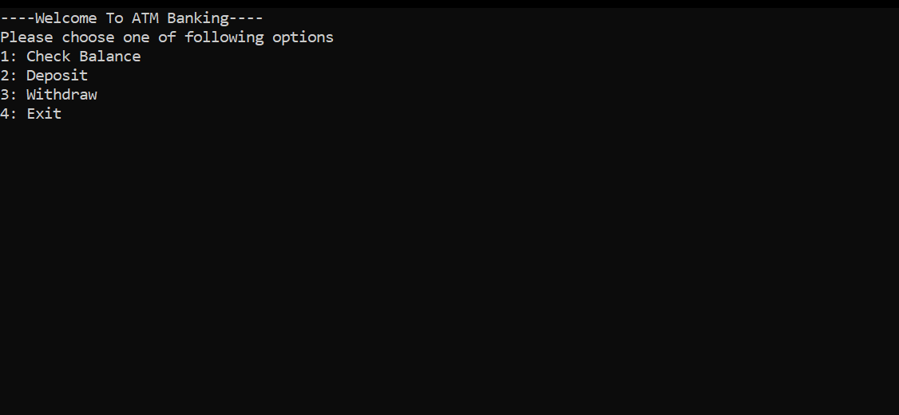
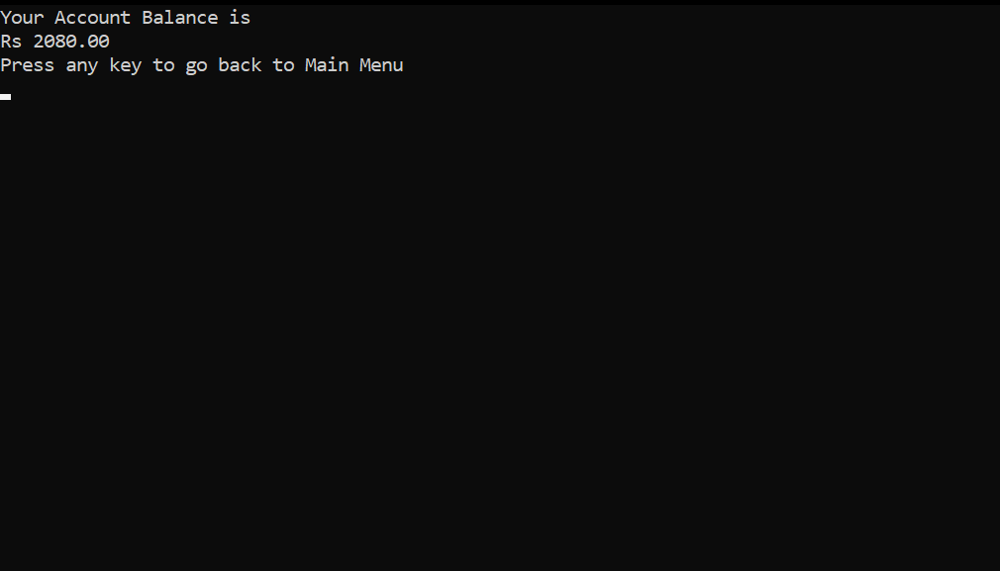
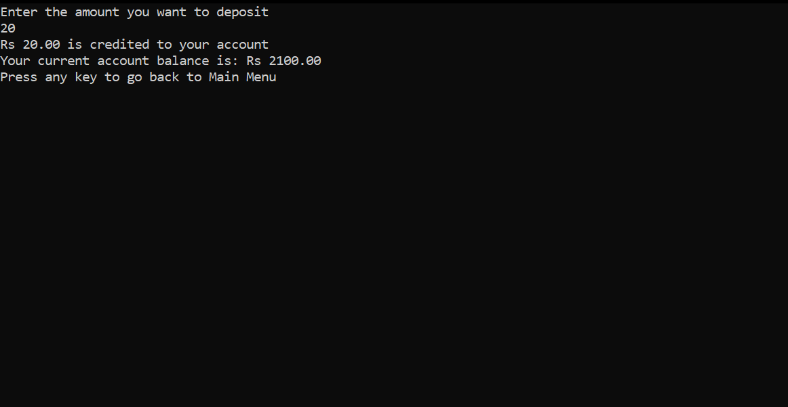
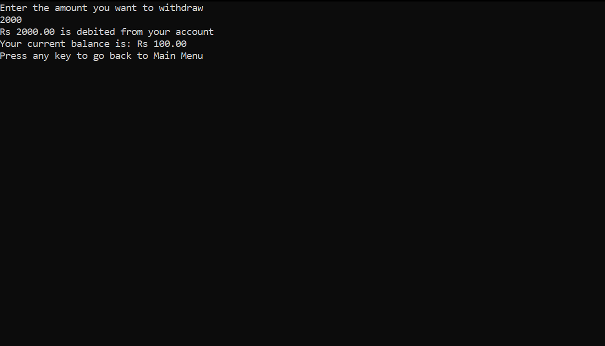

# simple_atm_system
Simple ATM Machine Program in C language with basic operations: check balance, deposit, withdraw

<h2>Screenshots</h2>  
<h3>Screenshot1</h3>  
  
<h3>Screenshot2</h3>  
  
<h3>Screenshot3</h3>  
  
<h3>Screenshot4</h3>  

